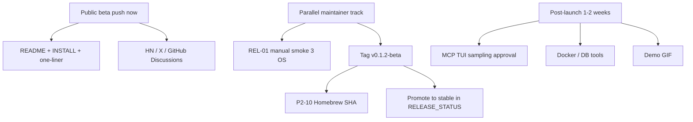

# Harness — Public Beta Promotion Report

**Date:** 2026-05-24  
**Verdict:** **GO** for public beta promotion now. **Stable** remains blocked on maintainer-only REL-01 manual smoke (§3) per target OS and post-tag Homebrew tap publish (P2-10).

---

## Executive summary

Harness is a fast, safety-focused, Rust-native terminal coding agent with multi-provider support, MCP, cost tracking, semantic memory, and solid CI across macOS, Linux, and Windows. Automated quality gates are green; security P0 items from the May 2026 audit are closed. The repository is well-documented and ready for public discovery.

**Recommended messaging:**

> Harness — a fast, Rust-native terminal coding agent. Multi-provider (Claude, Grok, GPT, Ollama), workspace sandbox, MCP, cost tracking. Public beta; stable after manual QA on macOS, Linux, and Windows.

---

## Release readiness matrix

| Gate | Status | Notes |
|------|--------|-------|
| `cargo test --all` | **Pass** | 218 tests (May 2026 Round 2) |
| `cargo clippy -D warnings` | **Pass** | All targets, all features |
| `cargo fmt --check` | **Pass** | |
| `cargo build --profile release-lto` | **Pass** | CI + local |
| `scripts/smoke_rel01.sh` | **Pass** | Automated REL-01 subset; doctor no longer blocks on setup wizard |
| P0 security | **Closed** | See [`PEER_REVIEW_AUDIT.md`](PEER_REVIEW_AUDIT.md) |
| Manual smoke §3 (REL-01) | **Pending** | Maintainer-only — API keys + TUI + serve + export |
| Homebrew tap (P2-10) | **Pending** | Run after next tag: `scripts/update-homebrew-sha.sh vX.Y.Z` |
| Prebuilt binaries | **Ready** | macOS arm64/x86_64, Linux x86_64/aarch64, Windows |
| README screenshots | **Done** | `docs/screenshots/tui.png`, `web-ui.png` |
| Demo GIF/video | **Optional** | Recommended for HN/README; not a beta blocker |

---

## Promotion tiers (execution order)

### Tier 0 — Ship beta now (no blockers)

- [x] Public repo with MIT license, threat model, install docs
- [x] One-liner install (`scripts/install.sh` / `install.ps1`)
- [x] Automated CI on Ubuntu, macOS, Windows
- [x] README feature list + comparison link + screenshots
- [ ] **Announce** — HN, X, GitHub Discussions (maintainer action)

### Tier 1 — Before “stable” label

| ID | Task | Owner | Command / doc |
|----|------|-------|---------------|
| REL-01 | Manual smoke §3 on macOS, Linux, Windows | Maintainer | [`PUBLIC_RELEASE.md`](PUBLIC_RELEASE.md) §3 |
| P2-10 | Homebrew tap SHA update | Maintainer | `bash scripts/update-homebrew-sha.sh v0.1.2-beta` |
| REL-02 | Tag + GitHub Release + verify prebuilts | Maintainer | [`RELEASE_PROCESS.md`](RELEASE_PROCESS.md) |
| REL-03 | Log REL-01 results in [`RELEASE_STATUS.md`](RELEASE_STATUS.md) | Maintainer | One row per OS |

### Tier 2 — High-impact polish (1–2 days)

| Task | Status | Notes |
|------|--------|-------|
| Refresh [`COMPARISON.md`](COMPARISON.md) | Done (this report) | Grok 4.x, MCP 2025, daemon, cost DB |
| [`CONTRIBUTING.md`](../CONTRIBUTING.md) pathways | Done | Tools, providers, tests, docs, community |
| Draft release notes | Done | [`RELEASE_NOTES_v0.1.2-beta.md`](RELEASE_NOTES_v0.1.2-beta.md) |
| GitHub `good first issue` label | Done | Label exists on repo; apply when issues are opened |
| Demo GIF (15–30s TUI) | Optional | Record `harness` session; link from README |

### Tier 3 — Next 1–2 weeks (growth, not launch blockers)

| Task | Priority | Notes |
|------|----------|-------|
| MCP sampling interactive TUI approval | High | Plan/smart currently deny inbound sampling |
| DatabaseTool / DockerTool / NotebookTool | Medium | See CONTRIBUTING → New tools |
| Mistral / Gemini providers | Medium | Four-step provider guide in CONTRIBUTING |
| VS Code + Tauri packaging | Medium | Icons, Windows/Linux bundles |
| Community channel (Discord / Matrix) | Low | Optional for beta |

---

## Already completed (do not re-open)

These items appeared on external promotion checklists but are **closed** in the repo:

| Item | Closed in |
|------|-----------|
| TUI scrollbar + follow-scroll | P2-1 |
| Session display names (first-message fallback) | P2-2 |
| Generic ambient provider (`AmbientProviders` + `[ambient]`) | R2-10 (`806d0a8`) |
| TUI model label sync with live provider | `6d57faa` |
| MIT Round 2 security + CI hardening | `95108dd` |
| README TUI + web UI screenshots | `0.1.1-beta` |

---

## Maintainer checklist (copy/paste)

```bash
source ~/.cargo/env
cd ~/Projects/harness/harness

# Automated gates
cargo fmt --all -- --check
cargo clippy --all-targets --all-features -- -D warnings
cargo test --all
cargo build --profile release-lto
bash scripts/smoke_rel01.sh

# REL-01 manual (needs API keys) — repeat per OS
harness "Reply with exactly: OK"          # one-shot
harness                                   # TUI round-trip
harness serve --addr 127.0.0.1:8787       # web chat
harness export <session-id>               # export Markdown

# After tagging v0.1.2-beta
bash scripts/update-homebrew-sha.sh v0.1.2-beta
# Publish GitHub Release using docs/RELEASE_NOTES_v0.1.2-beta.md
```

---

## Two-track launch model



---

## References

- Backlog: [`TODO.md`](../TODO.md)
- Latest verdict log: [`RELEASE_STATUS.md`](RELEASE_STATUS.md)
- Draft release notes: [`RELEASE_NOTES_v0.1.2-beta.md`](RELEASE_NOTES_v0.1.2-beta.md)
- Comparison table: [`COMPARISON.md`](COMPARISON.md)
